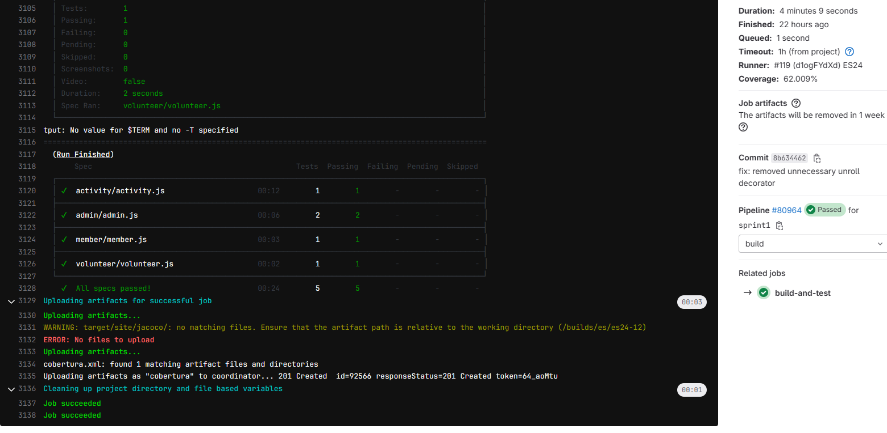
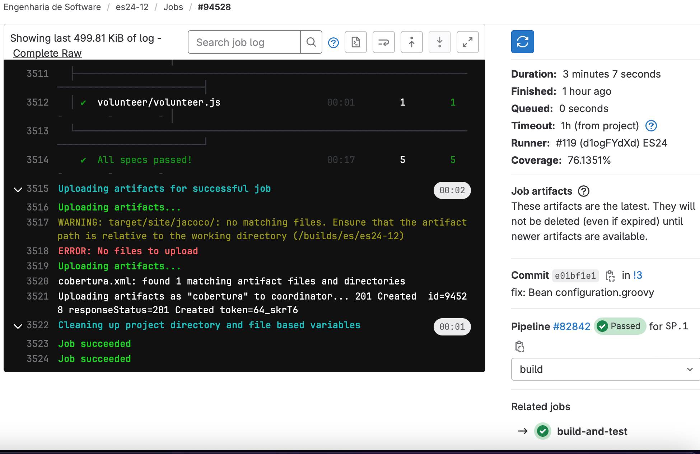
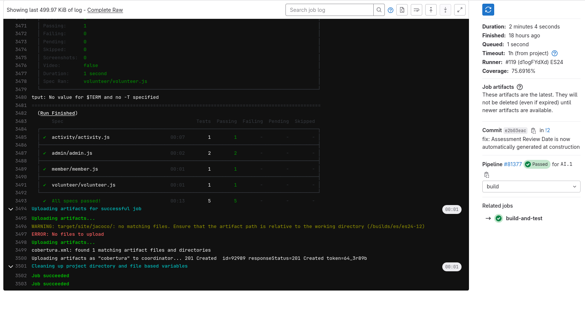

# ES P1 submission, Group 12

## Feature Activity Enrollment

### Subgroup
 - Pedro Luís Rodrigues de Almeida, ist1111383, [GitLab link](https://gitlab.rnl.tecnico.ulisboa.pt/ist1111383)
   + Issues assigned: [#1](https://gitlab.rnl.tecnico.ulisboa.pt/es/es24-12/-/issues/1),
                      [#8](https://gitlab.rnl.tecnico.ulisboa.pt/es/es24-12/-/issues/8),
                      [#9](https://gitlab.rnl.tecnico.ulisboa.pt/es/es24-12/-/issues/9),
                      [#10](https://gitlab.rnl.tecnico.ulisboa.pt/es/es24-12/-/issues/10),
                      [#11](https://gitlab.rnl.tecnico.ulisboa.pt/es/es24-12/-/issues/11),
                      [#12](https://gitlab.rnl.tecnico.ulisboa.pt/es/es24-12/-/issues/12),
                      [#13](https://gitlab.rnl.tecnico.ulisboa.pt/es/es24-12/-/issues/13),
                      [#14](https://gitlab.rnl.tecnico.ulisboa.pt/es/es24-12/-/issues/14),
                      [#15](https://gitlab.rnl.tecnico.ulisboa.pt/es/es24-12/-/issues/15),
                      [#16](https://gitlab.rnl.tecnico.ulisboa.pt/es/es24-12/-/issues/16),
                      [#17](https://gitlab.rnl.tecnico.ulisboa.pt/es/es24-12/-/issues/17),
                      [#26](https://gitlab.rnl.tecnico.ulisboa.pt/es/es24-12/-/issues/26),
                      [#35](https://gitlab.rnl.tecnico.ulisboa.pt/es/es24-12/-/issues/35),
                      [#36](https://gitlab.rnl.tecnico.ulisboa.pt/es/es24-12/-/issues/36),
                      [#38](https://gitlab.rnl.tecnico.ulisboa.pt/es/es24-12/-/issues/38),
                      [#55](https://gitlab.rnl.tecnico.ulisboa.pt/es/es24-12/-/issues/55)
                      

                      
 - João Pedro Correia e Sousa, ist199991, [GitLab link](https://gitlab.rnl.tecnico.ulisboa.pt/ist199991)
   + Issues assigned: [#1](https://gitlab.rnl.tecnico.ulisboa.pt/es/es24-12/-/issues/1),
                      [#11](https://gitlab.rnl.tecnico.ulisboa.pt/es/es24-12/-/issues/11),
                      [#12](https://gitlab.rnl.tecnico.ulisboa.pt/es/es24-12/-/issues/12),
                      [#13](https://gitlab.rnl.tecnico.ulisboa.pt/es/es24-12/-/issues/13),
                      [#14](https://gitlab.rnl.tecnico.ulisboa.pt/es/es24-12/-/issues/14),
                      [#15](https://gitlab.rnl.tecnico.ulisboa.pt/es/es24-12/-/issues/15),
                      [#16](https://gitlab.rnl.tecnico.ulisboa.pt/es/es24-12/-/issues/16),
                      [#17](https://gitlab.rnl.tecnico.ulisboa.pt/es/es24-12/-/issues/17),
                      [#35](https://gitlab.rnl.tecnico.ulisboa.pt/es/es24-12/-/issues/35),
                      [#36](https://gitlab.rnl.tecnico.ulisboa.pt/es/es24-12/-/issues/36),
                      [#38](https://gitlab.rnl.tecnico.ulisboa.pt/es/es24-12/-/issues/38),
 
### Merge requests associated with this feature

The list of pull requests associated with this feature is:

 - [MR #1](https://gitlab.rnl.tecnico.ulisboa.pt/es/es24-12/-/merge_requests/1)

### Test Coverage Screenshot

The screenshot includes the test coverage results associated with the new/changed entities:

---

## Feature Participant Selection

### Subgroup
 - Ricardo Espadinha, ist1100070, [GitLab link](https://gitlab.rnl.tecnico.ulisboa.pt/ist1100070)
   + Issues assigned: 
   + [#21](https://gitlab.rnl.tecnico.ulisboa.pt/es/es24-12/-/issues/21),
   + [#24](https://gitlab.rnl.tecnico.ulisboa.pt/es/es24-12/-/issues/24),
   + [#25](https://gitlab.rnl.tecnico.ulisboa.pt/es/es24-12/-/issues/25),
   + [#51](https://gitlab.rnl.tecnico.ulisboa.pt/es/es24-12/-/issues/51),
   + [#54](https://gitlab.rnl.tecnico.ulisboa.pt/es/es24-12/-/issues/54),
   + [#56](https://gitlab.rnl.tecnico.ulisboa.pt/es/es24-12/-/issues/56),
   + [#57](https://gitlab.rnl.tecnico.ulisboa.pt/es/es24-12/-/issues/57),
 - Guilherme Maia, ist196223, [GitLab link](https://gitlab.rnl.tecnico.ulisboa.pt/istist196223)
   + Issues assigned: 
   + [#19](https://gitlab.rnl.tecnico.ulisboa.pt/es/es24-12/-/issues/19), 
   + [#20](https://gitlab.rnl.tecnico.ulisboa.pt/es/es24-12/-/issues/20),
   + [#21](https://gitlab.rnl.tecnico.ulisboa.pt/es/es24-12/-/issues/21),
   + [#22](https://gitlab.rnl.tecnico.ulisboa.pt/es/es24-12/-/issues/22),
   + [#23](https://gitlab.rnl.tecnico.ulisboa.pt/es/es24-12/-/issues/23),
   + [#24](https://gitlab.rnl.tecnico.ulisboa.pt/es/es24-12/-/issues/24),
   + [#25](https://gitlab.rnl.tecnico.ulisboa.pt/es/es24-12/-/issues/25),
   + [#52](https://gitlab.rnl.tecnico.ulisboa.pt/es/es24-12/-/issues/52),
   + [#53](https://gitlab.rnl.tecnico.ulisboa.pt/es/es24-12/-/issues/53),
 
### Merge requests associated with this feature

The list of pull requests associated with this feature is:

 - [MR #1](https://gitlab.rnl.tecnico.ulisboa.pt/es/es24-12/-/merge_requests/3)

### Test Coverage Screenshot

The screenshot includes the test coverage results associated with the new/changed entities:

## Feature Institution Assessment

### Subgroup
 - Sebastião Rebelo Da silva Andrade e Sousa, ist190634, [GitLab link](https://gitlab.rnl.tecnico.ulisboa.pt/ist190634)
   + Issues assigned: [#27](https://gitlab.rnl.tecnico.ulisboa.pt/es/es24-12/-/issues/27),
                      [#29](https://gitlab.rnl.tecnico.ulisboa.pt/es/es24-12/-/issues/29),
                      [#33](https://gitlab.rnl.tecnico.ulisboa.pt/es/es24-12/-/issues/33),
                      [#34](https://gitlab.rnl.tecnico.ulisboa.pt/es/es24-12/-/issues/34),
                      [#37](https://gitlab.rnl.tecnico.ulisboa.pt/es/es24-12/-/issues/37),
                      [#39](https://gitlab.rnl.tecnico.ulisboa.pt/es/es24-12/-/issues/39),
                      [#40](https://gitlab.rnl.tecnico.ulisboa.pt/es/es24-12/-/issues/40),
                      [#41](https://gitlab.rnl.tecnico.ulisboa.pt/es/es24-12/-/issues/41),
                      [#42](https://gitlab.rnl.tecnico.ulisboa.pt/es/es24-12/-/issues/42),
                      [#45](https://gitlab.rnl.tecnico.ulisboa.pt/es/es24-12/-/issues/45),
                      [#49](https://gitlab.rnl.tecnico.ulisboa.pt/es/es24-12/-/issues/49),
                      [#50](https://gitlab.rnl.tecnico.ulisboa.pt/es/es24-12/-/issues/50)

                      
 - Rodrigo Fitas Dias, ist199552, [GitLab link](https://gitlab.rnl.tecnico.ulisboa.pt/ist199552)
   + Issues assigned: [#27](https://gitlab.rnl.tecnico.ulisboa.pt/es/es24-12/-/issues/27),
                      [#30](https://gitlab.rnl.tecnico.ulisboa.pt/es/es24-12/-/issues/30),
                      [#31](https://gitlab.rnl.tecnico.ulisboa.pt/es/es24-12/-/issues/31),
                      [#32](https://gitlab.rnl.tecnico.ulisboa.pt/es/es24-12/-/issues/32),
                      [#43](https://gitlab.rnl.tecnico.ulisboa.pt/es/es24-12/-/issues/43),
                      [#44](https://gitlab.rnl.tecnico.ulisboa.pt/es/es24-12/-/issues/44),
                      [#46](https://gitlab.rnl.tecnico.ulisboa.pt/es/es24-12/-/issues/46),
                      [#47](https://gitlab.rnl.tecnico.ulisboa.pt/es/es24-12/-/issues/47),
                      [#48](https://gitlab.rnl.tecnico.ulisboa.pt/es/es24-12/-/issues/48)
 
### Merge requests associated with this feature

The list of pull requests associated with this feature is:

 - [MR #2](https://gitlab.rnl.tecnico.ulisboa.pt/es/es24-12/-/merge_requests/2)

### Test Coverage Screenshot

The screenshot includes the test coverage results associated with the new/changed entities:

---